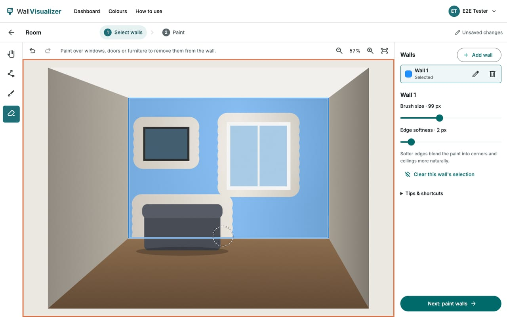
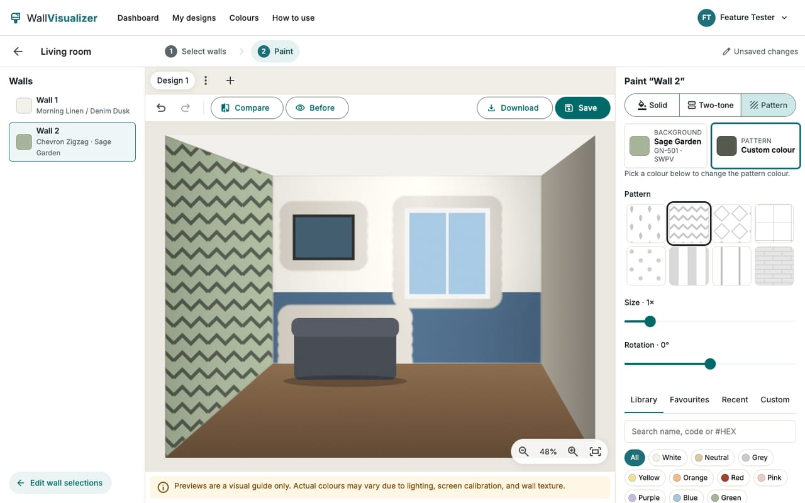
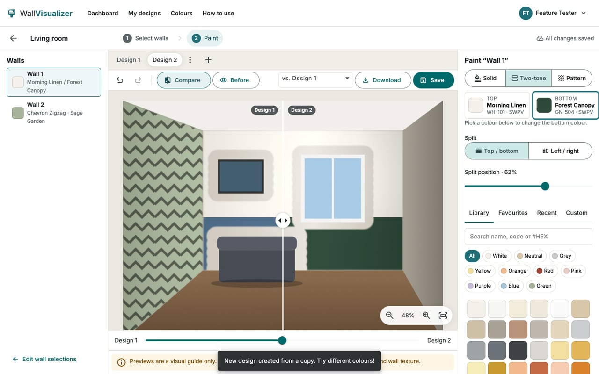
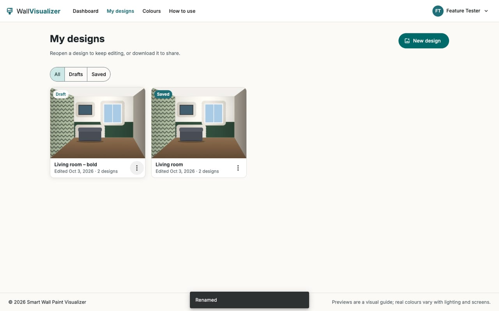
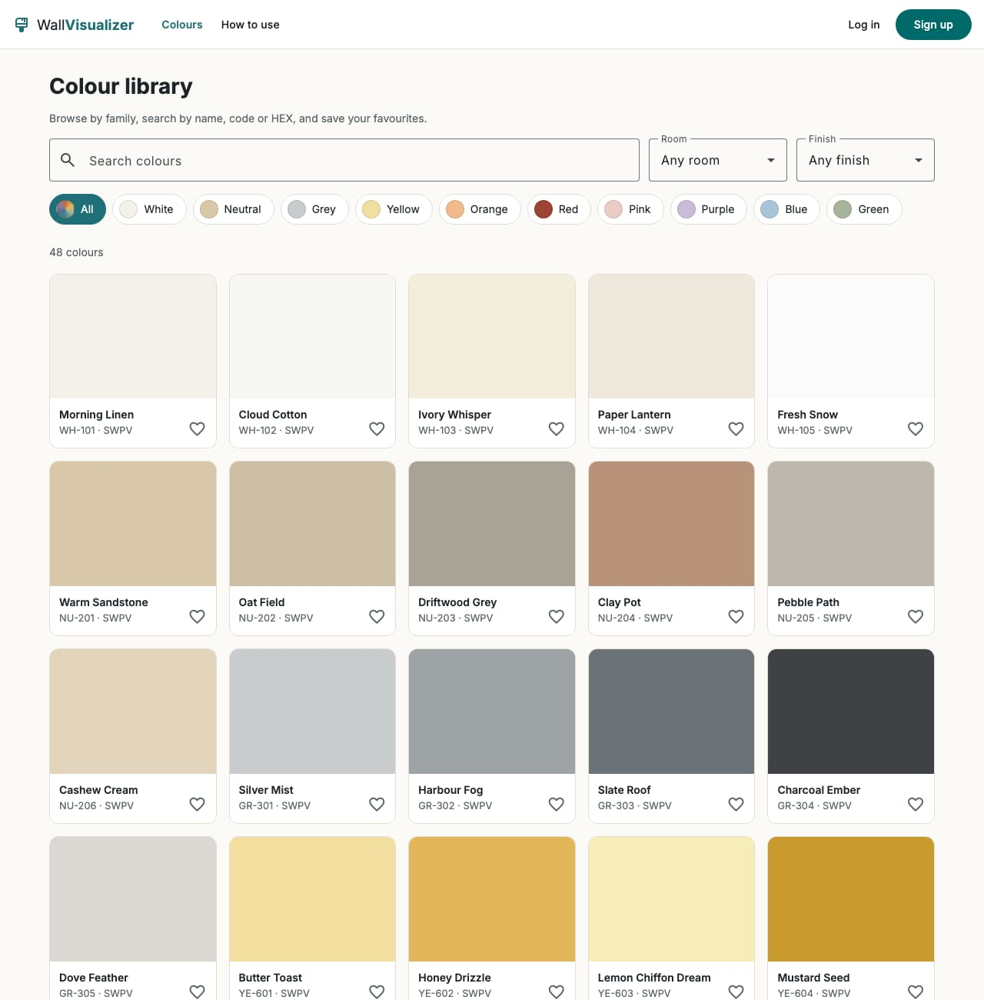
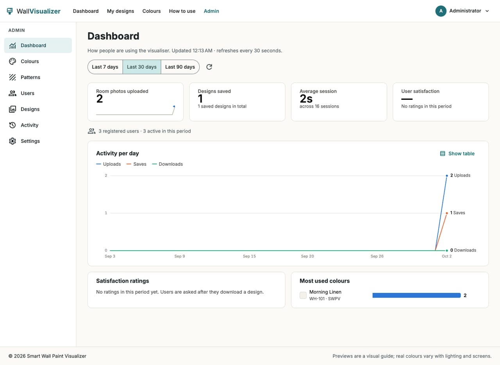

# 🎨 Smart Wall Paint Visualizer

> Preview wall paint colours and designs on your **own room photos** before you pick up a brush.


**Smart Wall Paint Visualizer** is a web app built on the **MEAN stack** (MongoDB, Express, Angular, Node.js). Upload a photo of your room, select the walls, try different colours and designs, and compare the before and after, all in your browser.

🔗 **Live demo:** _add your deployed URL here_ (see the [deployment guide](docs/deployment.md))

---

## 📸 Screenshots

| Select walls | Paint: two-tone and patterns |
|:------------:|:----------------------------:|
|  |  |
| **Compare two designs** | **My designs** |
|  |  |
| **Colour library** | **Admin dashboard** |
|  |  |

---

## 🤔 Why this project?

Choosing a wall colour is hard. Shade cards don't show how a colour looks in *your* lighting and *your* room, and a wrong choice means repainting costs and regret. This app gives you a realistic preview so you can decide with confidence.

**Who is it for?**
- 🏠 Homeowners planning a repaint
- 🧑‍🎨 Interior designers and painters during client consultations
- 🏪 Paint retailers helping customers decide

---

## ✨ Features

**For users**
- 🔐 Register and log in securely
- 🖼️ Upload room photos (JPG/PNG); location data is stripped and photos stay private
- ✏️ Select walls with **polygon**, **brush** and **eraser** tools, with undo/redo, zoom, pan and soft edges
- 🎨 Paint walls with **solid colours**, **two-tone splits** or **patterns**, from the library or any HEX code
- 💡 Realistic rendering that keeps your photo's light, shadows and texture
- 🎚️ Adjust opacity, brightness and finish (matte, satin, glossy)
- 🔀 Try several **design variants** on one photo and compare them side by side
- 👀 Compare **before and after** with a slider
- 💾 Auto-save, reopen, rename, duplicate and delete designs
- ⬇️ Download full-resolution PNG/JPG, or a before-and-after image, with colour names and codes
- ⭐ Favourite colours and quick access to recently used ones
- 🧭 First-use guide and an in-app **How to use** page

**For admins**
- 🗂️ Manage paint colours (with CSV/JSON bulk import) and pattern tiles
- 👥 Manage users (roles, deactivate), and view all designs and activity
- ⚙️ Configure upload limits, formats, default finish and the disclaimer text
- 📊 KPI dashboard: uploads, saved designs, average session time and user satisfaction, with trends and top colours

> ℹ️ **Note:** Results are a visual guide. Actual colours may vary due to lighting, screen calibration, and wall texture.

---

## 🧰 Tech Stack

| Layer | Technology |
|-------|-----------|
| **Frontend** | Angular 22 (standalone components, signals), Angular Material, TypeScript, HTML5 Canvas, SVG, SCSS |
| **Backend** | Node.js, Express 5, RESTful APIs, JWT authentication, Joi validation, sharp |
| **Database** | MongoDB (Mongoose) |
| **Storage** | AWS S3 with presigned links (local disk in development) |
| **Testing** | Mocha + Supertest (API), Vitest (app), Playwright (end-to-end) |
| **Deployment** | Vercel (app), Render with Docker (API), MongoDB Atlas, GitHub Actions |

---

## 🚀 Getting Started

### Prerequisites

- [Node.js](https://nodejs.org/) 18 or later
- [Docker](https://www.docker.com/) (runs MongoDB locally), or a free [MongoDB Atlas](https://www.mongodb.com/atlas) cluster
- Angular CLI is optional; the commands below use `npx ng`

### 1. Clone the repository

```bash
git clone https://github.com/<your-username>/smart-wall-paint-visualizer.git
cd smart-wall-paint-visualizer
```

### 2. Start MongoDB

```bash
docker compose up -d
```

This starts MongoDB 7 on `localhost:27017` with a persistent volume (`swpv-mongo-data`).

### 3. Set up the backend

```bash
cd server
npm install
cp .env.example .env
```

Open `.env` and set at least a long random `JWT_SECRET`. The defaults work for local development; every variable is explained in the [deployment guide](docs/deployment.md#environment-variables-api).

Seed the database with sample colours, patterns, default settings, and an admin account (safe to run more than once):

```bash
npm run seed
```

Start the API:

```bash
npm run dev
```

The API runs at `http://localhost:5050/api/v1`.

### 4. Set up the frontend

Open a new terminal:

```bash
cd client
npm install
npm start
```

Open **http://localhost:4200** in your browser. 🎉 Log in as the admin (`ADMIN_EMAIL` / `ADMIN_PASSWORD` from `.env`) to see the **Admin** panel.

During development, `/api` and `/static` requests are proxied to the API (`client/proxy.conf.json`), so no CORS setup is needed.

---

## 🧭 How to Use

1. **Sign up or log in.**
2. **Upload** a clear photo of your room.
3. **Select the walls** with the polygon or brush tool, and erase windows and furniture.
4. **Paint**: pick a colour or pattern, choose solid, two-tone or pattern, and fine-tune the finish.
5. **Compare** before and after, or two design ideas, with the slider.
6. **Save** your design and **download** the image.

> Tip: Photos taken in good, even lighting give the most realistic results.

---

## 📁 Project Structure

```
smart-wall-paint-visualizer/
├── client/                 # Angular app
│   └── src/app/
│       ├── core/           # auth, editor engine (rendering, masks, store), services
│       ├── shared/         # reusable components, models, utilities
│       └── features/       # landing, auth, dashboard, upload, wall-selection,
│                           # studio, colors, projects, profile, help, admin
├── server/                 # Node + Express API
│   └── src/
│       ├── config/  models/  routes/  controllers/
│       ├── services/       # images, storage (local/S3), analytics, imports
│       ├── middleware/  validators/  docs/ (OpenAPI)
│       └── seed/  scripts/
├── e2e/                    # Playwright end-to-end tests
├── docs/
│   ├── spec.md             # Product & technical specification
│   ├── deployment.md       # How to deploy (Atlas, S3, Render, Vercel)
│   └── screenshots/
├── docker-compose.yml      # Local MongoDB
├── render.yaml             # API hosting blueprint
└── .github/workflows/      # CI/CD
```

---

## 🔌 API Overview

Base URL: `/api/v1` · Interactive docs (Swagger): `http://localhost:5050/api/docs`

| Area | Example Endpoints |
|------|------------------|
| Auth | `POST /auth/register`, `POST /auth/login`, `GET /auth/me`, `PATCH /auth/password` |
| Projects | `GET /projects`, `POST /projects` (upload), `PUT /projects/:id`, `POST /projects/:id/duplicate`, `DELETE /projects/:id` |
| Colours & patterns | `GET /colors`, `GET /colors/:id`, `GET /patterns` (admins: create, update, remove, `POST /colors/import`) |
| Favourites | `GET /me/favorites`, `POST /me/favorites/colors/:id` |
| Admin | `GET /admin/analytics`, `GET /admin/users`, `GET /admin/activity`, `GET/PUT /admin/settings` |
| Tracking | `POST /activity`, `POST /feedback` |

---

## 🔒 Security

- Passwords hashed with bcrypt; JWT sessions that end on password change or deactivation
- Role-based access (User / Admin) on both the API and the app; users only see their own designs
- Upload checks by file content, size limits, and re-encoding that strips hidden data and GPS location
- Private images served through expiring signed links (HMAC locally, S3 presigned URLs in production)
- Helmet headers, CORS allow-list, rate limiting, NoSQL-injection sanitisation, HTTPS redirect + HSTS
- `npm audit` runs in CI; the app passes automated WCAG 2.1 AA checks (axe)

> Please upload only room images that you own or have permission to use.

---

## 🧪 Running Tests

```bash
# Backend (Mocha + Supertest + in-memory MongoDB)
cd server
npm test
npm run lint

# Frontend (Vitest)
cd client
npx ng test --watch=false
npx ng lint

# End-to-end (Playwright; reuses the API and app if they're running)
cd e2e
npm install
npx playwright install chromium   # first time only, or use your installed Chrome
npx playwright test
cd ../server && npm run e2e:clean  # remove the test accounts from your dev database
```

---

## ☁️ Deployment

See the step-by-step **[deployment guide](docs/deployment.md)**: MongoDB Atlas, an S3 bucket, the API on Render (Docker), the app on Vercel with your domain and HTTPS, and GitHub Actions for continuous deployment.

---

## 🗺️ Roadmap

**Phase 1 (current)**
- [x] Product specification
- [x] Project foundation (API skeleton, models, seed data, Angular shell, CI)
- [x] Authentication and user roles (register, login, profile, password change, role guards)
- [x] Colour library (browse by family, search, filters, swatch detail, favourites)
- [x] Image upload (validation, metadata stripping, private signed links, dashboard recent designs)
- [x] Manual wall selection (polygon, brush, eraser, multiple walls, undo/redo, zoom/pan, soft edges)
- [x] Solid colour application with realistic blending, finishes, before/after, auto-save
- [x] Dual-tone walls, patterns, and design variants (with side-by-side variant comparison)
- [x] Save, reopen, and download designs (full-resolution PNG/JPG, before/after export, Saved Designs page)
- [x] Admin panel and KPI dashboard
- [x] Hardening, tests, documentation, and deployment setup
- [ ] Live deployment with a custom domain

**Future ideas**
- AI-based automatic wall detection
- Advanced textures and 3D previews
- Day and night lighting simulation
- Integration with paint brands and retailers
- Mobile app and AR live preview

---

## 🤝 Contributing

Contributions are welcome!

1. Fork the repository
2. Create a branch: `git checkout -b feature/your-feature`
3. Commit your changes: `git commit -m "Add your feature"`
4. Push the branch: `git push origin feature/your-feature`
5. Open a Pull Request

Please follow the existing code style (ESLint and Prettier) and keep changes focused.

---

## 📄 Documentation

- 📄 [Project report (PDF)](docs/Project-Report.pdf)
- 📘 [Full specification](docs/spec.md)
- ☁️ [Deployment guide](docs/deployment.md)
- 🔌 API docs: available at `/api/docs` when the server is running
- 🧭 User guide: the **How to use** page in the app

---

## 📝 License

This project is licensed under the [MIT License](LICENSE).

---

## 🙌 Acknowledgements

- Colour browsing UX inspired by common paint-catalogue patterns. All design, code, and assets in this project are original.
- Built as a practical demonstration of full-stack development with the MEAN stack.

---

<p align="center">Made with ❤️ to help people choose the right colour the first time.</p>
